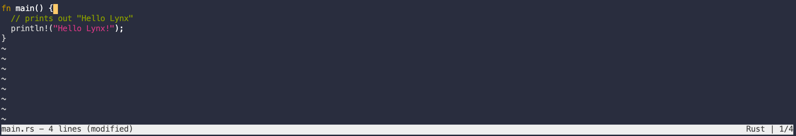

# lynx


</img>

A basic text editor written in Rust. Lynx was made <a href="https://www.philippflenker.com/hecto/">following this awesome tutorial</a> and adding more features.

## Current Features

- Open/edit/save file
- Syntax Highlighting - Rust, Python support
- Warn when quitting editor without saving file

## Todo

- Open folder
- Typescript, Javascript, TSX, JSX support
- Copy and paste ability

## Run Lynx

Make sure you have Rust, rustup, and cargo installed. You can do so here: https://www.rust-lang.org/tools/install.

1. Clone this repository

```
git clone https://github.com/henryboisdequin/lynx.git
```

2. Run the project

```
cargo run <file>
```

`<file>` is the file you want to edit in Lynx.
